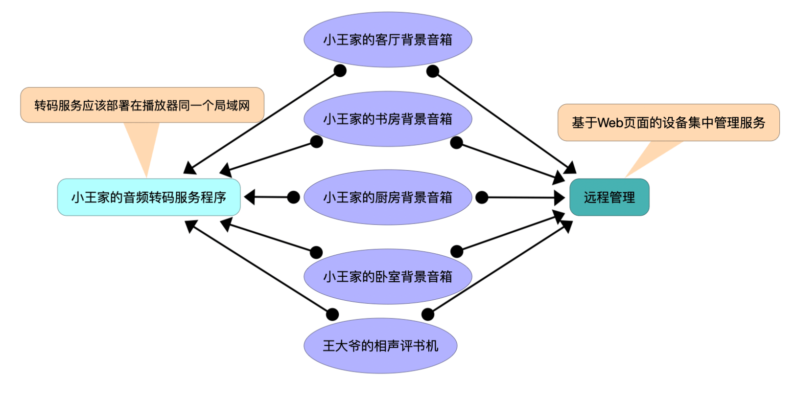

# BLPlayer

使用ESP32系列开发板，播放bilibili.com音频流的演示程序。

## 演示视频
 - 正在制作 ...
## 背景
 - 大部分ESP32开发板的板载内存非常有限，在上电后大概有260KB的可用内存。在开启蓝牙功能和Wi-Fi功能后，内存就已经消耗掉150KB左右。B站的大部分的音频数据流是m4a封装的AAC-LC格式。使用开发板将https的数据流下载回来，进行实时转码，再AAC解码播放，非常容易触发OOM, 导致ESP32重启。于是，将下载B站音频，并转码做成服务程序，ESP32通过http方式下载转码后的AAC音频数据，这样就变得可行。

## 大致框图

## 特点

- 硬件需求: 一个蓝牙音箱（蓝牙耳机）+ 一块ESP32开发板。
- 支持自动查找附近的蓝牙音箱
- 页面远程播放控制

## 安装

### 源码安装

1. 修改src/wifi_config.h中定义WIFI网络为自己家的网络，再使用vscode+platformio编译刷入固件到ESP32
2. 蓝牙音箱开机，并确保音箱没有与其他设备进行蓝牙连接，同时ESP32上电，ESP32首先会尝试WIFI连接，然后会搜索附近信号最好的蓝牙音箱进行连接。
3. 上述过程在第一次启动时大概需要30-60秒，完成后，可以按esp32上的boot按键，正常情况下，会从蓝牙音箱中听到一段音效。
4. 接下来，长按ESP32的BOOT按键5秒以后松开按键，可以通过音箱听到一个6位的数字码，也可以从终端的log中查看该数字码
5. 浏览器打开 https://iot.fadai8.cn/esp32audio.html
6. 填入听到的6位数字码,将ESP32添加到远程管理，点击页面上“播放指定音乐”按钮，测试音乐是否正常播放。
7. 从github的Release的btunnel中，下载本地主机能运行的转码服务程序，启动程序
8. 在页面上，配置好转码服务URL: 'http://{你的转码服务IP地址}:60588/tun'，并点击‘保存配置’
9. 在页面上的音乐URL中填入B站的音频链接，点击‘播放指定音乐’测试转码服务是否正常
10. 安装完毕

### 浏览器安装

- 等待补充

## 查看日志
  - 可以通过串口输出查看运行时的各种调试信息

## 重置数据
  - 当刷好固件后，只需在ESP32上电后3秒左右，按rst按键即可重置连接数据，包含Wi-Fi的连接数据和蓝牙设备的连接数据。

## 贡献

## 许可证
  - GPL-3.0 license