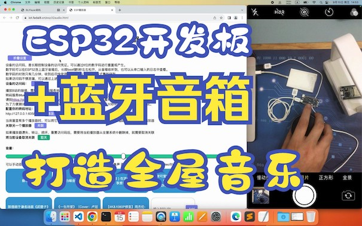
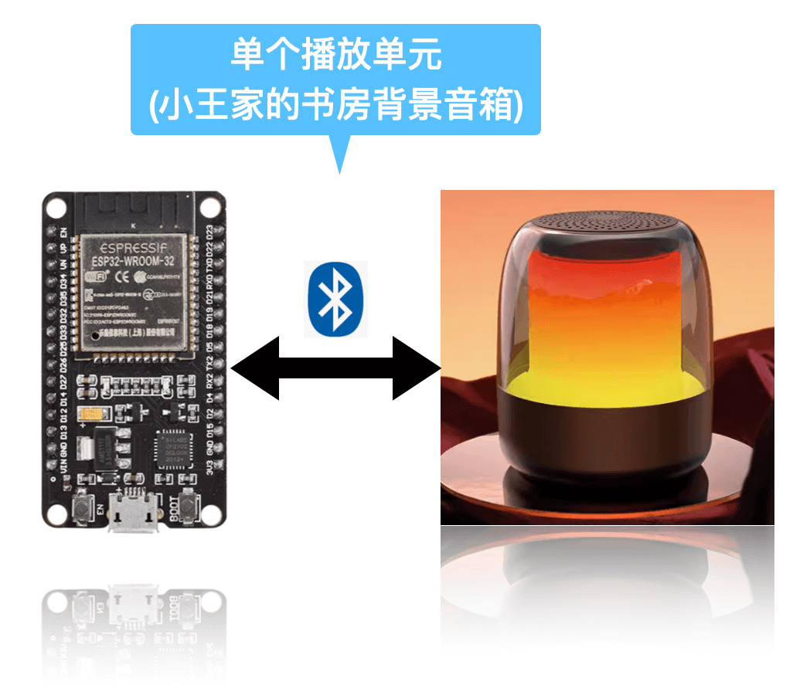
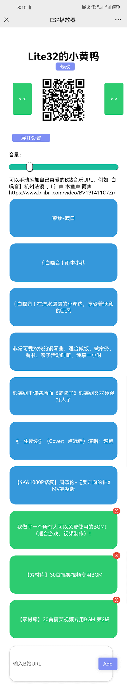

# BLPlayer

使用ESP32系列开发板，连接蓝牙音箱，播放bilibili.com音频流，打造全屋背景音乐。

## 演示视频
 - ## [《ESP32开发板配合蓝牙音箱，DIY全屋音乐，安装教程》](https://www.bilibili.com/video/BV1FV411A7cp/)
 - 

## 背景
 - 大部分ESP32开发板的板载内存非常有限，在上电后大概有260KB的可用内存。在开启蓝牙连接和Wi-Fi功能后，内存就已经消耗掉150KB左右。B站的大部分视频中的音频数据流是m4a封装的AAC-LC格式。使用开发板将https的数据流下载回来，进行实时转码，再AAC解码播放，非常容易触发OOM, 导致ESP32重启。这个应用是将B站音频下载、转码做成局域网内的独立服务程序，ESP32通过http方式实时播放转码后的AAC音频数据。

## 待开发的功能
  - 多单元一起播放同一曲目
  - 本地缓存：对下载的音频数据做本地缓存
  - 支持条件式自动化播放，例如工作日晨间起床音乐，助眠音乐
  - 支持Home Assistant的集成

## 大致框图
 - ### 单一播放单元框图
 - - 
 
 - ### 全屋播放单元框图
 - - 

## 特点

- 硬件需求: 单个播放单元只需，一套蓝牙音箱（蓝牙耳机）+ 一块ESP32开发板。
- 支持自动连接离开发板最近，信号最好的蓝牙音箱
- 支持页面远程播放控制（手机，电脑都可以控制），无需安装app。

## 安装

### 源码安装

1. 修改src/wifi_config.h中定义WIFI网络为自己家的网络，再使用vscode+platformio编译刷入固件到ESP32
2. 蓝牙音箱开机，并确保音箱没有与其他设备进行蓝牙连接，同时ESP32上电，ESP32首先会尝试WIFI连接，然后会搜索附近信号最好的蓝牙音箱进行连接。
3. 上述过程在第一次启动时大概需要30-60秒，完成后，可以按esp32上的boot按键，正常情况下，会从蓝牙音箱中听到一段音效。
4. 浏览器打开 https://iot.fadai8.cn/esp32audio.html
5. 接下来，长按ESP32的BOOT按键5秒以后松开按键，可以通过音箱听到一个6位的数字码，也可以从串口的输出log中查看该数字码。
6. 在网页的‘设备访问码’处填入听到的6位数字码，将ESP32添加到远程管理。产生访问码后，收藏该URL，这个URL为以后控制这个播放设备的页面。
7. 从[BLPlayer/releases](https://github.com/noolua/BLPlayer/releases)中，下载本地主机(例如windows, linux, macos, 嵌入式Linux开发板，openwrt路由器等)匹配的转码服务程序btunnel，启动程序。
8. 在页面上，配置好转码服务URL: 'http://{你的转码服务IP地址}:60588/tun'。
9. 安装完毕，在页面上选择一首音乐进行播放测试。

### 浏览器安装

1. 浏览器需求: 高版本的chrome，chromium浏览器都可以
2. 打开刷机页面: https://fadai8.cn/downloads/iot/BLPlayer/webtool/index.html
3. USB数据线，一端接开发板，一端接电脑USB口。蓝牙音箱开机，确认没有其他设备连接到音箱。
4. 在页面上点击 “安装”
5. 在弹出的对话框中选择正确的COM端口，一般为cu.usbxxxx、901x系列、210x系列，如果没有识别出来，请确认数据线是否正常，还有驱动是否安装正常。
6. 然后根据页面提示选择刷机。
7. 当刷机完成后，不要立刻断开ESP32与电脑的连接，此时可以在页面上可以选择配置Wi-Fi
8. 配置完成，点击确认，等待开发板自动联网与发现蓝牙音箱。
9. 正常情况下，需要30-90秒的操作时间，然后会从音箱听到一串6位数的数字码，重复三遍。如果失败，请重复上述过程。
10. 打开设备管理页面: https://iot.fadai8.cn/esp32audio.html
11. 在网页的‘设备访问码’处填入听到的6位数字码，将ESP32添加到远程管理。产生访问码后，收藏该URL，这个URL为以后控制这个播放设备的页面。
12. 从[BLPlayer/releases](https://github.com/noolua/BLPlayer/releases)中，下载本地主机(例如windows, linux, macos, 嵌入式Linux开发板，openwrt路由器等)匹配的转码服务程序btunnel，启动程序。
13. 在页面上，配置好转码服务URL: 'http://{你的转码服务IP地址}:60588/tun'。
14. 安装完毕，在页面上选择一首音乐进行播放测试。

## boot按键功能定义
- 按住1秒，释放按键：蓝牙音箱的连接性测试，正常情况下，可以从音箱听到一段提示音。
- 按住5秒，释放按键：获得6位数字码，用于产生远程控制的访问码。
- 按住20秒，释放按键: 重置开发板上保存的Wi-Fi和蓝牙音箱数据。

## 查看日志
  - 可以通过串口输出查看运行时的各种调试信息,还有重置的数字码也可以从串口输出中查看。

## 重置开发板数据
  - 方式一：使用浏览器重刷固件可以重置esp32保存的Wi-Fi和蓝牙设备数据。
  - 方式二：在esp32上电后，按住boot按钮20秒以上再松开，也可以重置Wi-Fi和蓝牙设备数据。  

## 操作界面
 - ### 手机上的界面
  - - 

## 贡献

## 致谢
  - https://github.com/SocialSisterYi/bilibili-API-collect
  - https://github.com/nilaoda/BBDown
  - https://github.com/pschatzmann/ESP32-A2DP
  - https://github.com/earlephilhower/ESP8266Audio
  - https://esphome.github.io/esp-web-tools/

## 许可证
  - GPL-3.0 license